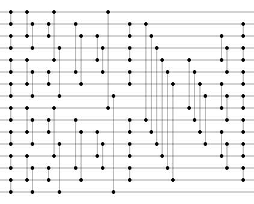
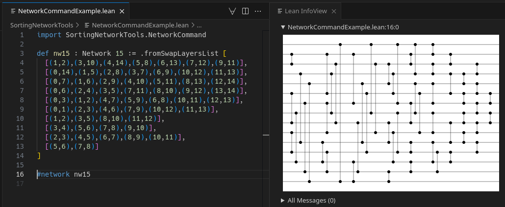

# SortingNetworkTools



SortingNetworkTools (SNT) is a suite of tools for handling [sorting networks](https://en.wikipedia.org/wiki/Sorting_network). It can:

- Convert comparison networks to different formats (e.g., SVG, viewable in a web browser)
- Verify the correctness of existing networks
- Search for new sorting networks via an evolutionary strategy

## Table of Contents

- [Download, build, and run](#download-build-and-run)
- [`snt convert` - Convert a network to a format](#snt-convert---convert-a-network-to-a-format)
- [`snt verify` - Verify a network's correctness](#snt-verify---verify-a-networks-correctness)
- [`snt evolve` - Create new sorting networks through repeated mutation](#snt-evolve---create-new-sorting-networks-through-repeated-mutation)
- [Lean InfoView Integration](#lean-infoview-integration)

## Download, build, and run

This project depends on [elan](https://github.com/leanprover/elan), the [Lean](https://lean-lang.org/) version manager. Once installed, use the following commands to build and run the SortingNetworkTools binary, `snt`:

```sh
git clone https://github.com/MichaelMMacLeod/SortingNetworkTools.git
cd SortingNetworkTools
lake exe snt
```

## `snt convert` - Convert a network to a format

There are currently two implemented formats, `list` and `svg`. The command `snt convert` can produce networks formatted in either.

### Formats

- `list`: a condensed textual representation of a network
- `svg`: Scalable Vector Graphics, a graphical representaiton of a network viewable in a web browser

### Examples

- Convert a [Batcher odd-even mergesort](https://en.wikipedia.org/wiki/Batcher_odd%E2%80%93even_mergesort) network with 16 channels to SVG and store it in the file `batcher.html`

    ```sh
    $ lake exe snt convert --algorithm batcher 16 svg > batcher.html
    ```

- Convert a [Bubble sort](https://en.wikipedia.org/wiki/Bubble_sort) network with 8 channels to the `list` format

    ```sh
    $ lake exe snt convert --algorithm bubble 8 list
    0:1,1:2,0:1,2:3,1:2,3:4,0:1,2:3,4:5,1:2,3:4,5:6,0:1,2:3,4:5,6:7,1:2,3:4,5:6,0:1,2:3,4:5,1:2,3:4,0:1,2:3,1:2,0:1
    ```

- Load a network in the `list` format from `network.txt` and convert it to an SVG, storing the result in `network.html`
    ```sh
    $ lake exe snt convert --load network.txt svg > network.html
    ```

## `snt verify` - Verify a network's correctness

The command `snt verify` can check if a network is correct or incorrect via the [zero-one principle](https://en.wikipedia.org/wiki/Sorting_network#Zero-one_principle):

> The zero-one principle states that, if a sorting network can correctly sort all 2ⁿ sequences of zeros and ones, then it is also valid for arbitrary ordered inputs. This not only drastically cuts down on the number of tests needed to ascertain the validity of a network, it is of great use in creating many constructions of sorting networks as well.

We use [maximal LFSRs](https://en.wikipedia.org/wiki/Linear-feedback_shift_register) to, in constant space, exhaustively generate all (nonzero) 2ⁿ sequences in a random order (to more quickly rule out incorrect networks.) The verifier encodes sequences in a way that enables it to check 64 sequences in parallel on a single core (currently only one core is supported.) This encoding technique comes from the excellent [SorterHunter project](https://github.com/bertdobbelaere/SorterHunter).

### Example

- Check if the network stored in `network.txt` is correct (the network should be stored in the `list` format, see the section on [snt convert](#snt-convert---convert-a-network-to-a-format))

    ```sh
    $ lake exe snt verify --load network.txt
    ```

## `snt evolve` - Create new sorting networks through repeated mutation

The command `snt evolve` uses a (currently rudimentary) evolutionary strategy to find sorting networks. It first attempts to find a correct network. Once found, it tries to reduce its number of layers and compare-and-exchange operations by randomly mutating it.

The network at each stage will be printed in the `list` format (see [snt convert](#snt-convert---convert-a-network-to-a-format).)

### Example

- Evolve a network with 4 channels, beginning with nothing (an empty network)

    ```sh
    $ lake exe snt evolve --algorithm empty 4
    Evolving with randomly selected seed 6416384735446536867

    Evolving from an empty network

    (Attempting to grow a correct network) Evolved to 1 layers containing a total of 2 compare-and-exchange operations
    0:1,2:3

    (Attempting to grow a correct network) Evolved to 3 layers containing a total of 6 compare-and-exchange operations
    0:1,2:3,0:2,1:3,0:1,2:3

    (Reducing the size of a correct network) Evolved to 4 layers containing a total of 7 compare-and-exchange operations
    0:1,2:3,0:2,1:3,0:1,2:3,1:2

    (Reducing the size of a correct network) Evolved to 3 layers containing a total of 5 compare-and-exchange operations
    0:2,1:3,0:1,2:3,1:2
    ```

## Lean InfoView Integration

SortingNetworkTools defines the `#network <network>` command, a [Lean Widget](https://lean-lang.org/examples/1900-1-1-widgets/) which displays the SVG representation of `<network>` in the Lean InfoView.


