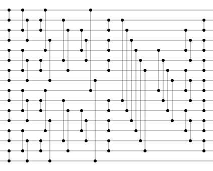

# SortingNetworkTools

SortingNetworkTools (SNT) is a suite of tools for handling [sorting networks](https://en.wikipedia.org/wiki/Sorting_network). It can:

- Convert comparison networks to different formats (e.g., SVG, viewable in a web browser)
- Verify the correctness of existing networks
- Search for new sorting networks via an evolutionary strategy
